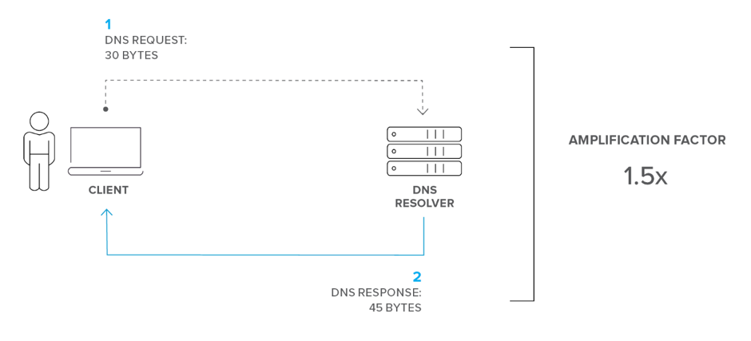
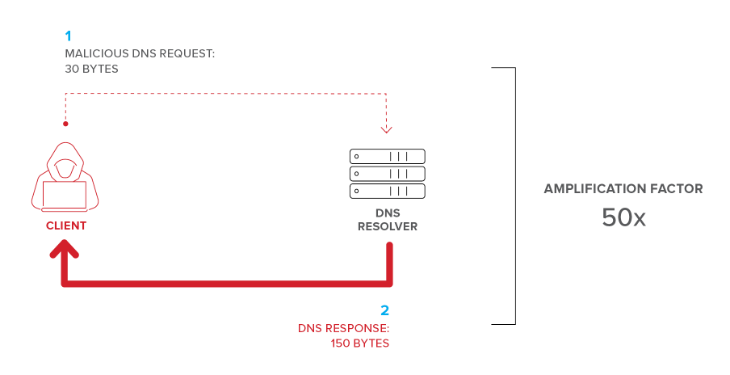
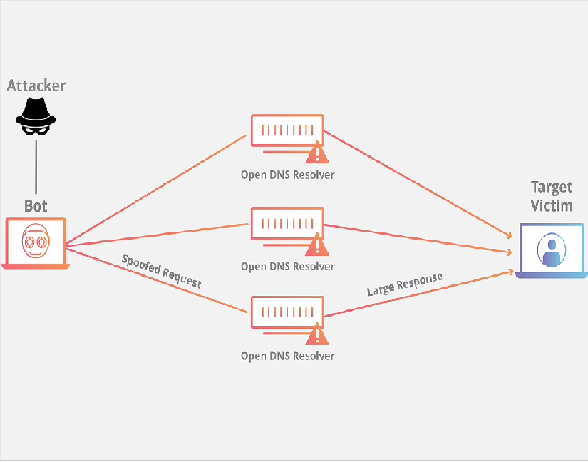

# DNS Amplification Attack

A **Domain Name System (DNS)** amplification attack is just one of many types of **distributed denial-of-service (DDoS)** attacks. As with all DDoS attacks, the goal of attackers is to keep users from accessing a networked system, service, website, application, or other resource by making it slow to respond or disabling it entirely.

**DNS amplification** is a type of reflection attack which manipulates publically-accessible domain name systems, making them flood a target with large quantities of UDP packets. Using various amplification techniques, perpetrators can “inflate” the size of these UDP packets, making the attack so potent as to bring down even the most robust Internet infrastructure.

## How DNS Server Works and Its Vulnerabilities

 When a user types **www.example.com** into their browser, DNS is the Internet service that accepts that request, finds the IP address assigned to that domain name, and sends it back to the browser so the client can connect to that website.

There’s a specific process for finding that address, beginning with the user’s device checking its local cache; if not found, then querying the assigned Internet Service Provider’s (ISP’s) DNS servers (resolvers); if not found, then proceeding through a hierarchy of DNS resolvers across the Internet until the IP address is found. Internally, a corporate network typically only resolves DNS requests for its own employees, but the Internet is full of “open,” publicly accessible DNS resolvers that will resolve DNS requests for anyone—including attackers. Using these open resolvers, attackers can send many fake requests without raising any red flags.

So, what’s next for attackers? Amplification. Remember, their goal is to turn relatively small DNS requests into huge responses. A typical DNS request (just a few lines of text) is very small—usually in the tens of bytes—and returns a response that’s only slightly larger. As shown in Figure 1, a genuine (non-malicious) DNS response might have an amplification factor of 1.5 or less.

## How It works

In a DNS amplification attack, malicious actors take advantage of the normal operation of the Domain Name System (DNS)—the “address book” of the Internet—using it as a weapon against a targeted victim’s website. The goal is to flood the website with fake DNS lookup requests that consume network bandwidth to the point that the site fails.

To achieve their goal, attackers craft DNS requests in a way that substantially amplifies the size of the response. One way to do this is by requesting not just the IP address for a site like www.example.com, but information about the entire domain (for example, using DNS requests for the record type “ANY”), so the response might include details about subdomains, backup servers, mail servers, aliases, and more. Suddenly, a 10-byte DNS request could generate a response that’s 10, 20, even 50 times larger.

The process can be broken down into four steps:

1. The attacker uses a compromised endpoint to send UDP packets with spoofed IP addresses to a DNS recursor. The spoofed address on the packets points to the real IP address of the victim.
2. Each one of the UDP packets makes a request to a DNS resolver, often passing an argument such as “ANY” in order to receive the largest response possible.
3. After receiving the requests, the DNS resolver, which is trying to be helpful by responding, sends a large response to the spoofed IP address.
4. The IP address of the target receives the response and the surrounding network infrastructure becomes overwhelmed with the deluge of traffic, resulting in a denial-of-service.

## Mitigating DNS Amplifications Attacks

The following steps can be taken to mitigating DNS Amplification Attacks:

- Configure local DNS servers to only handle DNS requests from within the organization.
- Use a DNS-aware firewall to only allow DNS responses into the network that match requests sent from local DNS servers.
- Use DNS Anycast to distribute traffic and avoid overloading any single DNS server.
- When feasible, use a third-party DDoS protection (scrubbing) service.

## Example Project

This an example project from Waqar Hasan Khan: [DoS Attack to The DNS Server](https://github.com/Waqar-107/DoS-Attack-to-The-DNS-Server)

## Courtesy

- [f5 labs](https://www.f5.com/labs/articles/education/what-is-a-dns-amplification-attack-)

- [cloud flare](https://www.cloudflare.com/learning/ddos/dns-amplification-ddos-attack/)

- [imperva](https://www.imperva.com/learn/application-security/dns-amplification/)