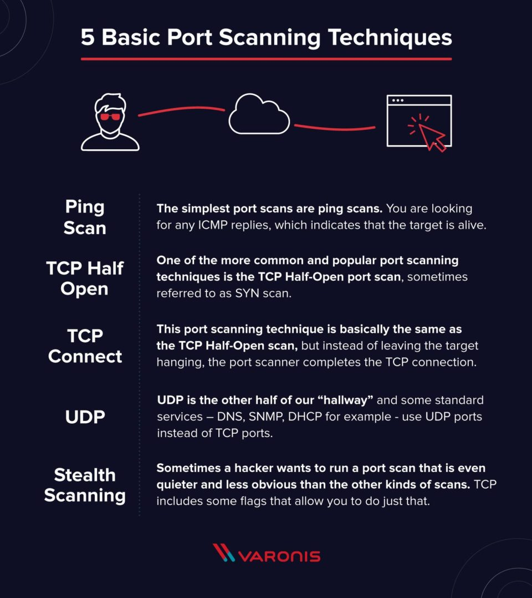

# Port Scanner

A port scanner is a simple computer program that checks all of those doors – which we will start calling ports – and responds with one of three possible responses: **Open**, **Closed**, or **Filtered**.

There are **two** kinds of ports on each computer – TCP, and UDP – and 65,536 of each.

The first 1024 TCP ports are the well-known ports like FTP(21), HTTP(80), or SSH(22). Anything above 1024 is available for use by services or applications.

Cybercriminals use a port scanner to find potential weak points they could exploit, with malware or a Trojan on that system, or to use that computer to connect to other systems in your network.

## How It Works

Port scanning is quite simple: a port scanner sends a request to connect to a port on a computer and records the response.

There are **three possible**responses:

- Open, Accepted: The computer responds and asks if there is anything it can do for you.
- Closed, Not Listening: The computer responds that “This port is currently in use and unavailable at this time.”
- Filtered, Dropped, Blocked: The computer doesn’t even bother to respond, it has no time for shenanigans.

Cybercriminals are looking for open ports that they can use as communication relays or infiltration vectors into your network. Any open port they can find is a possible access point for further infiltration into your network.

## Techniques

Let’s check out some different port scanning techniques.

### Ping Scan

The simplest port scans are ping scans. A ping is an **Internet Control Message Protocol (ICMP)** echo request – you are looking for any ICMP replies, which indicates that the target is alive. A ping scan is an automated blast of many ICMP echo requests to different targets to see who responds.

Administrators usually disable ping either on the firewall or on the router. It’s quick and easy to turn off this functionality and make it impossible to scout the network this way. However, ping is a good troubleshooting tool, and turning it off makes tracking down network problems a little more difficult.

In **portScan.py** file, we send curl request to get the response for a specific port. Previously I tried with a ping command, but I can not ping a specific port. So, I use curl request.

### TCP Half-Open

One of the more common and popular port scanning techniques is the TCP Half-Open port scan, sometimes referred to as SYN scan. It’s a fast and sneaky scan that tries to find potential open ports on the target computer. This scan is fast because it never completes the full TCP 3 way-handshake. The scanner sends a SYN message and just notes the SYN-ACK responses. The scanner doesn’t complete the connection by sending the final ACK: it leaves the target hanging.

Any SYN-ACK responses are possible connections: an RST(reset) response means the port is closed, but there is a live computer here. No responses indicate SYN is filtered on the network. Any SYN-ACK replies are a quick way cybercriminals can find the next potential target.

You can find a port scanner by this technique in tcpHalfOpenScan.py file.

## TCP Connect

This port scanning technique is basically the same as the TCP Half-Open scan, but instead of leaving the target hanging, the port scanner completes the TCP connection.

It’s not as popular a technique as the TCP Half-Open. First, you have to send one more packet per scan, which increases the amount of noise you are making on the network. Second, since you complete the connection with the target, you might trip an alarm that the Half-Open scan wouldn’t.

## Resourses

- [Avast Answer](https://smb.avast.com/answers/port-scanning-techniques-and-explanations#:~:text=Port%20scanning%20is%20a%20method,analyzing%20responses%20to%20identify%20vulnerabilities.)

- [Varonis](https://www.varonis.com/blog/port-scanning-techniques/)
